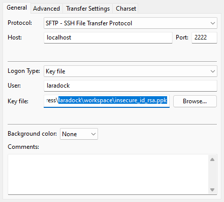
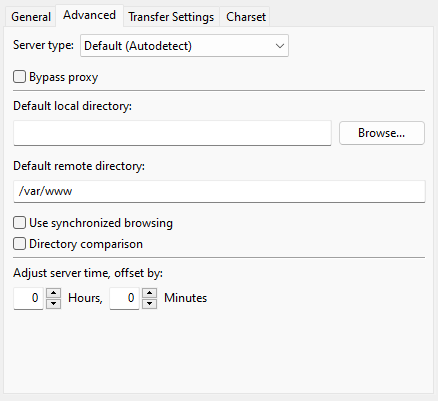

# laradock-wordpress

## Installation

Add these lines to your `hosts` file:

```txt
127.0.0.1 laradock.test
127.0.0.1 *.laradock.test
```

This project can be used with any Linux/Mac environment with Docker installed. WSL2 + Docker Desktop is recommended for Windows users.

Prepare WSL2:

```powershell
PS wsl --set-default-version 2
PS wsl --install --distribution Ubuntu
# Username: user
# Password: secret
PS wsl --set-default Ubuntu
PS wsl -l -v
PS wsl --update
$ sudo apt update && sudo apt upgrade -y
```

## Usage

Enter project folder (for example in WSL2), actual path can be vari depending on your setup

```sh
$ cd /mnt/c/www-docker/laradock-wordpress
```

Copy `.env` file into it's place:

```sh
$ cp .env.example .env
```

You can define in `./.env` file, which web server you want to use, `apache2` or `nginx`. For shared hosting target environment, `apache2` is preferred. Another diferrence is, `nginx` can only host a single site, while `apache2` can host multiple sites.

```ini
# apache2 or nginx
WEBSERVER=apache2
```

You also need to define your websites. This is crucial for mass backup & restore shell scripts to work:

```ini
SITES=site1,site2
```

```sh
# Examine config
$ ./bin/compose.sh config

# Pull Laradock repository
$ ./bin/compose.sh preinstall

# Start docker-compose
$ ./bin/compose.sh up

# Bootstrap the environment
$ sudo mkdir -p ~/.laradock/backup
$ sudo chown -R $(id -u):$(id -u) ~/.laradock/backup
$ ./bin/compose.sh bootstrap

# Stop the service
$ ./bin/compose.sh down

# Stop the service and destroy everything
$ ./bin/compose.sh prune
# If you want to remove your database and project files, run this command
$ sudo rm -rf ~/.laradock
# To only cleanup Portainer
$ sudo rm -rf ~/.laradock/data/portainer_data

# Backup webserver files & databases
# TODO: copy .htaccess
$ ./bin/compose.sh backup_all

# Restore webserver files & databases
# First, you need to manually delete the project's folder in ~/.laradock/data/html
# then place your backups in ~/.laradock/backup
$ sudo mkdir -p ~/.laradock/backup
$ sudo chown -R $(id -u):$(id -u) ~/.laradock/backup
$ ./bin/compose.sh restore_all

# Backup single website
$ ./bin/backup_single_site.sh -s [sitename]

# Restore single website
$ ./bin/restore_single_site.sh -s [sitename] -l /mnt/e/[filepath]/backup_[filename].tar.gz

# WP CLI usage
# https://make.wordpress.org/cli/handbook/guides/running-commands-remotely/
$ docker exec laradock-workspace-1 wp --allow-root --help
$ docker exec laradock-workspace-1 wp --allow-root package install wp-cli/restful
$ docker exec laradock-workspace-1 wp --allow-root --http=mesziair.hu --user=mesziair rest user list
```

## FileZilla settings for SFTP access

Create a link which pointing to `insecure_id_rsa.ppk` key inside Laradock's workspace folder.





## URLs

* [https://laradock.test/](https://laradock.test/)
* [PHPINFO](https://laradock.test/phpinfo.php)
* [Adminer](http://localhost:8081/?server=laradock-mariadb-1&username=default)
* [Portainer](https://localhost:9443/)
* [WSL2 Development files](\\\wsl.localhost\Ubuntu\home\user\\.laradock)

## Reading

Laradock: [documentation](https://laradock.io/), [repository](https://github.com/Laradock/laradock/)

## GitHub issues regarding this project

Self:

* [env_file field in Logstash making impossible to use untouched Laradock project structure](https://github.com/laradock/laradock/issues/3146)
* [Multiple --env-file cli arguments not be merged correctly, if it's an environment or key configuration option](https://github.com/docker/compose/issues/9166)

Others:

* [WordPress asking for FTP credentials to install plugins (FIXED)](https://github.com/docker-library/wordpress/issues/298)
* [Nginx file permission problems (need to change uid/gid for www-data)](https://github.com/laradock/laradock/issues/2799)

wp-content should be owned by www-data:

* [Hardening WordPress](https://wordpress.org/support/article/hardening-wordpress/)
* [Docker bind mount uid/gid problem](https://techflare.blog/permission-problems-in-bind-mount-in-docker-volume/)

WSL2 slow filesystem performance: solution is to copy application files into WSL filesystem.

* [[wsl2] filesystem performance is much slower than wsl1 in /mnt](https://github.com/microsoft/WSL/issues/4197)
* [WSL2 Extremely slow file read fix (mutagen)](https://j0eii.cwh-labs.com/wsl2-extremely-slow-file-read-fix-mutagen/)

## TODO

* Implement Ansible deployment to the Raspberry Pi
* Set UID:GID to 1000 in nginx image
* Create production build from Laradock
* Implement Varnish Cache with nginx: [Article](https://d2c.io/post/fast-scalable-wordpress), [Proxy Cache Purge](https://wordpress.org/plugins/varnish-http-purge/), [FakerPress](https://wordpress.org/plugins/fakerpress/)

## Misc

```sh
# Example to enter a running container
$ docker-compose exec workspace bash
$ docker exec -it {workspace-container-id} bash
```

## GTMetrix optimization guides

* [fiverr guide](https://www.fiverr.com/search/gigs?query=wordpress%20optimization&source=top-bar&search_in=everywhere&search-autocomplete-original-term=wordpress%20optimization&utm_source=23679&utm_medium=cx_affiliate&utm_campaign=wp_summary_a&afp=&cxd_token=23679_17007605&show_join=true)
* [GTMetrix Wp guide](https://gtmetrix.com/wordpress-optimization-guide.html)
* [GTMetrix third-party code guide](https://gtmetrix.com/reduce-the-impact-of-third-party-code.html)
